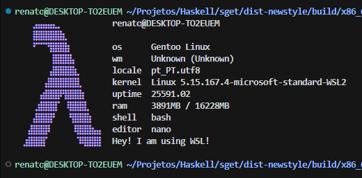
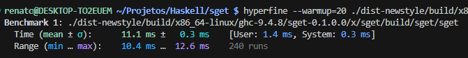

    <h1>sget - system get</h1>
    <h6>A system fetch utility written in Haskell.</h6>
    

# Why is this?
awesome-fetch *never* featured a Haskell-made fetch script, and I
thought "Why not make a Haskell fetch?" and I ended up getting it
done in 2 days. It was quite fun to learn how much I could feature
without abusing IO. (Which while on my searches, I found a
FreeBSD-based fetch which does abuse IO, no offense to the
developer.) and I have to admit I am proud of how I have done!

# Is this complete?
I want change some things around (for example, adding color and
displaying uptime in HH:MM:SS), and I will change them if I have the
time. I have already achieved a product, now it's just about making
it good.

However, I am happy to review pull requests and issues for those that
can read my code... somehow! 😄

# How fast is it?
Not *blazingly fast* but it isn't noticably slow either.

